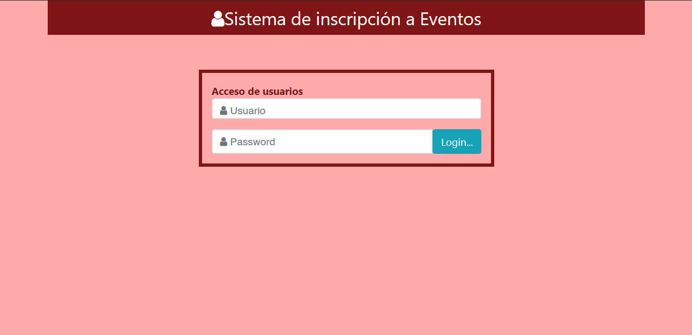

# 📻 Gestión de Log in - Java
<p align="center">
  
</p>

Este proyecto es un sistema desarrollado en **Java SE y Java EE** diseñado para gestionar el log in de una pagina web de festivales. 
Permite la administración eficiente de los usuarios.

---

## 🚀 Características principales
* **Gestión de Datos:** Implementación de lógica para el control de Usuario y Evento.
* **Arquitectura:** Estructura organizada siguiendo el patrón de MVC.
* **Persistencia:** Uso colecciones de Java (Lists) y una base de datos.

## 🛠️ Tecnologías utilizadas
* **Lenguaje:** Java 11
* **IDE:** Eclipse IDE
* **Control de Versiones:** Git & GitHub

## 📂 Estructura del Proyecto
* `src/`: Contiene todo el código fuente (.java).
* `.gitignore`: Configuración para mantener el repositorio limpio de archivos temporales de Eclipse.
* `.project` & `.classpath`: Archivos de configuración para importar fácilmente en Eclipse.

## ⚙️ Instalación y Ejecución
1. Clona el repositorio:
```bash
   git clone [https://github.com/jmpm8/JavaEEGestionEventosEmisora.git](https://github.com/jmpm8/JavaEEGestionEventosEmisora.git)
